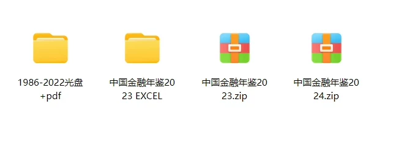
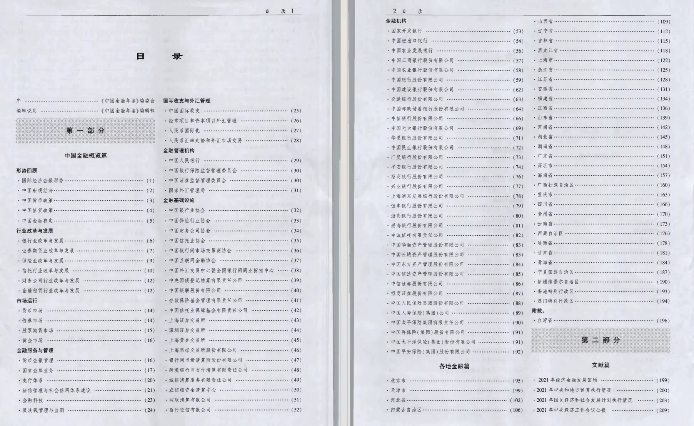
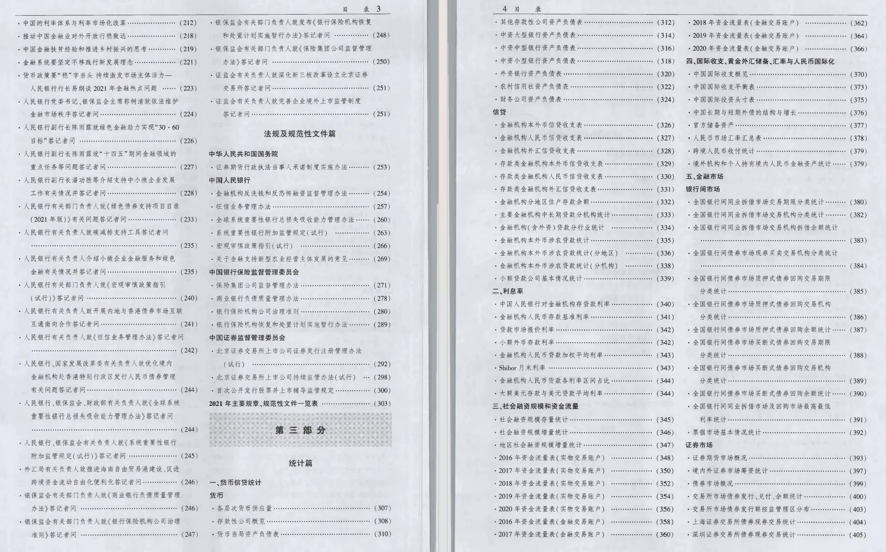
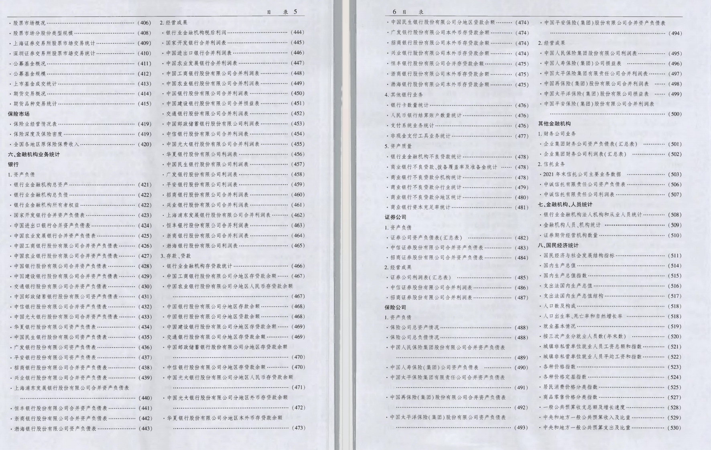
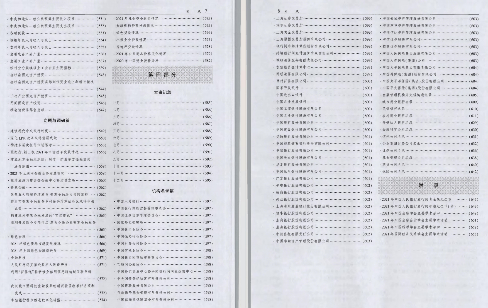

## Body

China Financial Yearbook (1986-2024)

Data Year: The yearbook covers the years 1986 to 2024. (The data year should be one less than the yearbook year for accurate calculation).

01. Data Introduction
"China Financial Yearbook"

02. Index Details
The directory is displayed in the picture, please view it on your own and purchase accordingly. If you need help finding specific data, all information is here. After shipment, returns without reason are not supported.
PS. The 2024 version is in Excel format, only containing partial content, do not place orders if you are unsure.
The display directory is for the year 2022, and the statistical methods may change from year to year. For academic purposes, please be aware of this.

03. Data Content
Format: The CD-ROM edition plus PDF edition is available from 1986 to 2022. The 2024 and 2023 versions are exclusively in Excel format, please do not place orders if you have any concerns.
The 2024 version is in Excel format, only containing partial content, do not place orders if you are unsure.

## Images

Here is a pay link on Stripe ( https://buy.stripe.com/3cs8yP7sY87d0vu9AB ). Please contact me lonlonago@foxmail.com after funding $89, and I will send you a complete data files , thank you!

